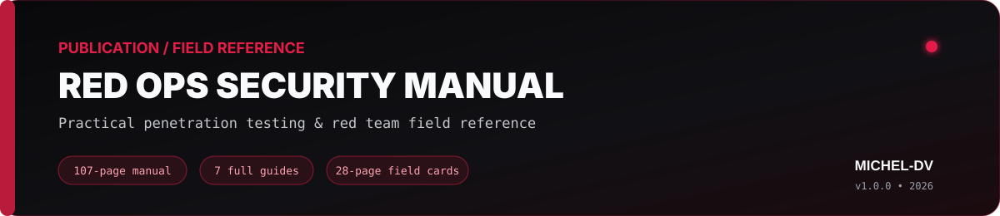

<p align="center">
  
</p>

<p align="center">
  <a href="https://github.com/Michel-DV/ProcSentinel-C"></a>
  <a href="https://github.com/Michel-DV/Win-TraceGuard"></a>
  <a href="https://github.com/Michel-DV/VoidWalker"></a>
  <a href="https://github.com/Michel-DV/Go-Fast-Scanner"></a>
  <a href="https://github.com/Michel-DV/Analisi-MyDoom"></a>
  <a href="https://github.com/Michel-DV/red-ops-security-manual"></a>
</p>

## About this profile

I build practical cybersecurity projects around **Windows internals, endpoint telemetry, detection engineering, malware analysis, network security and IoT security** — and I publish technical field references that turn those ideas into repeatable assessment workflows.

The goal of this profile is not to collect one-off scripts. Each flagship repository is treated as a small engineering project: clear scope, reproducible builds, tests, CI, structured output, documentation and an explicit security boundary.

> **Security scope:** projects here are intended for authorized labs, defensive research, detection engineering, education, or controlled security testing.

## Flagship engineering projects

| Project | What it demonstrates | Stack |
| --- | --- | --- |
| **[ProcSentinel-C](https://github.com/Michel-DV/ProcSentinel-C)** | Windows endpoint and PE triage: process metadata, SHA-256, Authenticode, PE analysis, TCP ownership correlation and explainable risk scoring. | C11 · WinAPI · CMake |
| **[Win-TraceGuard](https://github.com/Michel-DV/Win-TraceGuard)** | ETW telemetry sensor with TDH decoding, PID/PPID correlation, behavioral detections, JSONL capture and replay. | C11 · ETW · TDH · WinAPI |
| **[VoidWalker](https://github.com/Michel-DV/VoidWalker)** | Defensive IoT discovery and exposure triage with SSDP/mDNS evidence, fingerprinting and vulnerability-candidate analysis. | Python · Networking · IoT |
| **[Go-Fast-Scanner](https://github.com/Michel-DV/Go-Fast-Scanner)** | Concurrent TCP connect scanning with bounded workers, cancellation, validated input, IPv4/IPv6-safe addressing and JSON output. | Go · Concurrency · TCP |
| **[Analisi-MyDoom](https://github.com/Michel-DV/Analisi-MyDoom)** | Malware-analysis and detection-engineering case study with report, YARA, Sigma, machine-readable IOCs and ATT&CK mapping. | YARA · Sigma · Python · CTI |
| **[Python-RedTeam-C2-Framework](https://github.com/Michel-DV/Python-RedTeam-C2-Framework)** | Loopback-only controller/agent protocol lab focused on framing, validation, safe command dispatch, testing and detection-oriented study. | Python · Sockets · Protocols |

## Publication & field reference

<a href="https://github.com/Michel-DV/red-ops-security-manual">
  
</a>

**[RED OPS Security Manual](https://github.com/Michel-DV/red-ops-security-manual)** is my connected field reference for authorized penetration testing and red team workflows.

The **v1.0.0 Complete Edition** is organized as a 107-page manual with seven complete guides and a 28-page field-card set covering recon, network enumeration, web content discovery, post-exploitation, Active Directory, credential testing, wireless auditing and cross-phase hand-offs.

The public repository is intentionally limited to project information, a controlled preview, provenance records and publication metadata; the complete customer edition and private build/source tree are kept outside the public repo.

Authorship and provenance are explicitly recorded under **Michel-DV** through the repository history, `CITATION.cff`, release manifests, document metadata and copyright notices.

## Legacy Windows research

**[Windows-Process-Injector-C](https://github.com/Michel-DV/Windows-Process-Injector-C)** is intentionally kept outside the flagship engineering set and presented as a **legacy WinAPI research PoC**. It documents the classic `OpenProcess → VirtualAllocEx → WriteProcessMemory → CreateRemoteThread` chain so the underlying Windows primitive can be studied from a malware-analysis and detection-engineering perspective. Its README explicitly documents the technique, defensive telemetry, ATT&CK T1055 mapping, limitations and lab-only scope.

That project is useful in the portfolio because it creates a clear progression:

```text
understand the injection primitive
          ↓
observe endpoint state with ProcSentinel-C
          ↓
correlate behavior over time with Win-TraceGuard
```

## Portfolio map

<p align="center">
  
</p>

## Engineering approach

```text
security idea
    │
    ├── define scope & threat model
    ├── build the smallest useful core
    ├── make behavior observable
    ├── add structured output
    ├── test edge cases
    ├── automate CI
    ├── document assumptions & limits
    └── publish only what has a clear security boundary
```

A few principles recur across the repositories:

- **Explainability over magic scores** — detections and triage signals should show why they fired.
- **Read-only by default** — endpoint tooling favors observation and analysis rather than modification.
- **Safe lab boundaries** — simulation projects are deliberately constrained instead of hiding unrestricted behavior behind a new label.
- **Reproducibility** — CI, tests and build instructions are part of the project, not an afterthought.
- **Useful output** — human-readable terminal views plus JSON/JSONL or machine-readable artifacts where appropriate.
- **Field usability** — documentation should help move from one assessment phase to the next, not just list commands in isolation.

## Project health

<p>
  <a href="https://github.com/Michel-DV/ProcSentinel-C/actions/workflows/ci.yml"></a>
  <a href="https://github.com/Michel-DV/Win-TraceGuard/actions/workflows/ci.yml"></a>
  <a href="https://github.com/Michel-DV/VoidWalker/actions/workflows/ci.yml"></a>
  <a href="https://github.com/Michel-DV/Go-Fast-Scanner/actions/workflows/ci.yml"></a>
  <a href="https://github.com/Michel-DV/Python-RedTeam-C2-Framework/actions/workflows/ci.yml"></a>
  <a href="https://github.com/Michel-DV/Analisi-MyDoom/actions/workflows/build-report.yml"></a>
</p>

## Releases & publications

- **RED OPS Security Manual** — `v1.0.0`
- **ProcSentinel-C** — `v1.0.0`
- **Win-TraceGuard** — `v1.0.1`
- **VoidWalker** — `v2.1.0`
- **Go-Fast-Scanner** — `v2.0.0`
- **Python C2 Lab** — `v2.1.0`
- **MyDoom Analysis & Detection Engineering** — `v2.0.0`

---

<p align="center">
  <sub><code>MDV // build things that make security behavior easier to observe, understand and explain.</code></sub>
</p>
